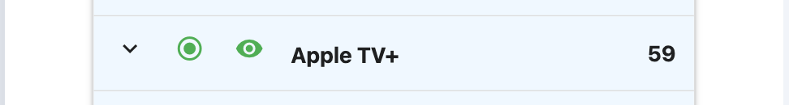

# Subscription Manager

Subscription Manager is a powerful tool designed to simplify the way you handle your subscriptions. Keeping track of various subscriptions for online services can be challenging. It’s often difficult to get a clear overview of your monthly expenses. Subscription Manager is here to help you manage and monitor all your subscriptions in one place.

The live link can be found here -[Subscription Manager](https://subscription-manager-da751aeb9bdc.herokuapp.com/)

## Table of Contents

<!-- TOC -->

- [Subscription Manager](#subscription-manager)
    - [Table of Contents](#table-of-contents)
        - [User Stories](#user-stories)
            - [EPIC | Accounts](#epic--accounts)
            - [EPIC | Navigation](#epic--navigation)
            - [EPIC | Subscriptions](#epic--subscriptions)
            - [EPIC | Reminders](#epic--reminders)
            - [EPIC | Services](#epic--services)
            - [EPIC | Categories](#epic--categories)
        - [Design](#design)
            - [Colour Scheme](#colour-scheme)
            - [Icons](#icons)
            - [Wireframes](#wireframes)
    - [Agile Methodology](#agile-methodology)
    - [Data Model](#data-model)
    - [Testing](#testing)
    - [Features](#features)
        - [Login and sign up](#login-and-sign-up)
        - [Navigation](#navigation)
        - [Subscription](#subscription)
        - [Error Pages](#error-pages)
        - [Not implemented](#not-implemented)
        - [Future Features](#future-features)
    - [Deployment - Heroku](#deployment---heroku)
        - [Create the Heroku App:](#create-the-heroku-app)
        - [Attach the Postgres database:](#attach-the-postgres-database)
        - [Prepare the environment and settings.py file:](#prepare-the-environment-and-settingspy-file)
        - [Create files / directories](#create-files--directories)
        - [Update Heroku Config Vars](#update-heroku-config-vars)
        - [Deploy](#deploy)
    - [Forking this repository](#forking-this-repository)
    - [Cloning this repository](#cloning-this-repository)
    - [Languages](#languages)
    - [Frameworks - Libraries - Programs Used](#frameworks---libraries---programs-used)
    - [Credits](#credits)
    - [Acknowledgments](#acknowledgments)

<!-- /TOC -->

### User Stories

Some of the user stories could possibly be acceptance criterias instead of user stories, but since they were added later when the user story was already implented they were added as user stories.

#### EPIC | Accounts

- As a user, I want to be able to create an account by providing my email address and a password, so that I can register and log in to the application.
- As a user I can cancel log out so that i don't need to log in again if i change my mind.
- As a administrator I can view, edit, and delete user accounts so that I can manage access to the application

#### EPIC | Navigation

- As a user i can navigate the website using a menu so that i can find the information i am looking for.
- As a user I can read about the application on the start page so that i understand how to use it.

#### EPIC | Subscriptions

- As a user I can add a subscription by filling out a form with the name, cost, and renewal date so that I can see it in my overview.
- As a user I can see a list of all my subscriptions so that i get an overview
- As a user I can edit a subscription so that I can update with relevant information.
- As a user i can delete a subscription from the list so that i only have the relevant subscriptions in my list.
- As a user i can make a subscription inactive so that it’s still on the list so that i can make it active again when i start using it again.
- As a user i can categorize my subscriptions so that i can view costs for each category
- As a user i can see a summary of my total monthly expenses for subscriptions so that I can budget my expenses more effectively.
- As a user i can view the details of a subscription so that i can decide if i want to keep it
- As a user I can add my own service name when i add a subscription so that i can track all my subscriptions even if they are not in the service list
- As a user I want to see subscriptions and services in alphabetical order so that i can easier find what i'm looking for

#### EPIC | Reminders

- As a user i can create a reminder with a custom message for a subscription that will be shown on a specific date so that i can decide whether to keep the subscription or not
- As a user I can receive a reminder so that I remember to manage the subscription
- As a user I can edit a reminder so that I can change the date or message for the reminder
- As a user i can delete a reminder so that it’s not shown when it’s not needed
- As a user I want to receive a mail with my reminder note so that I don't have to log in to the application every day
- As a user I can add a mail address that the reminder will be sent to so that i can receive a mail reminder even if i don't have a mail address on my account

#### EPIC | Services

- As a administrator I can add, edit, and delete services so that I can manage the list of available subscription services

#### EPIC | Categories

- As a administrator I can create, modify, and remove categories so that I can organize subscription services into logical groups.

### Design

The Subscription Manager web application is designed with a user-centric approach, emphasizing an engaging and intuitive user experience. The goal is to provide users with a seamless way to manage and track their various online subscriptions while offering clear insights into their monthly expenses through the strategic use of icons and colors.

- The application's interface is designed to be straightforward, with a clean menu structure that allows users to easily access different sections such as adding subscriptions, viewing subscriptions, setting reminders, and summarizing expenses.
- The interface utilizes icons to represent different actions, such as a plus sign for adding subscriptions and a chart for summary. This visual approach helps users quickly understand and perform tasks without confusion. Icons are also used to visualize the state of the subscription and if there's an active reminder.w
- The layout avoids unnecessary clutter, focusing on essential information and actions. This ensures that users can quickly find what they are looking for without feeling overwhelmed.
- Subscriptions are grouped into categories such as streaming services, music, cloud storage, and more. This categorization helps users understand their spending patterns and identify areas where they might want to cut back.
- Clicking on a subscription reveals detailed information including the service name, monthly cost, category, and any notes. This detail view also provides options to edit or delete the subscription.
- Users can view a summary of expenses by category, allowing them to see how much they spend on different types of services each month.
- Users can set up email reminders for specific subscriptions, with alert icons indicating if a reminder is active and if the reminder has been triggered. This feature ensures users are notified ahead of time, helping them avoid unwanted charges.
- The form for adding new subscriptions is designed to be simple, with auto-fill options for common services and clear input fields for subscription name and monthly price.
- Users can easily update their subscription details through an edit form that mirrors the simplicity of the add subscription form.
- The application is built to be fully responsive, ensuring a seamless experience across devices, whether on a desktop, tablet, or mobile phone.

#### Colour Scheme

Colour...

#### Icons

There is only one static image ...

#### Wireframes

Wireframes were created at an early stage of the project to provide a visualization of how the application would look on both mobile and desktop. During the development process, some minor deviations were made from the original design.

Mobile

Desktop

## Agile Methodology

The project was structured into five one-week sprints, each beginning with a planning session that utilized the MoSCoW method for prioritizing user stories and issues from the backlog. Detailed acceptance criteria and tasks were defined for each user story to ensure clarity and focus. Throughout the sprints, minor adjustments were made to accommodate new insights and challenges, ensuring that the project stayed on track and met its objectives effectively.

Link to GitHub project: [Subscription Manager board](https://github.com/users/andersganander/projects/4)

Sprint 1

**Objective:** First sprint. Objective is to set up the project, implement at least one admin user story and make first deploy to Heroku.

The goals of the sprint were achieved except for the deployment to Heroku, which was not done. This will instead be one of the goals for the next sprint.

Sprint 2

**Objective:** Add model and basic functionality for subscriptions. First deploy to Heroku.

Sprint 3

**Objective:** Add styling with materialize for signup, llogin, edit and add. Functionality for adding reminders. Fix routing for first page. Add logic for checking if user is logged in.

Some of the user stories didn’t have any tasks when the sprint was started since they were dependent on decisions that would be made in user storys that was to be implemented earlier in the sprint. 

**Changes during sprint:**
- During the work with subscription details in the subscription list there were som design changes that affected the data models. Since the most important design principle in this project is simplicity and making it as easy as possible for the user to manage their subscriptions the following decisions were made:
  - Add fields for reminder date and reminder note into the subscription detail. 
    **Reason:** There’s a risk for adding complexity and making the user confused if reminders are handled separately. It will also be easier for the user to manage reminders together with the subscription.
  - Remove expiry date. 
    **Reason:** The sole purpose of the expiry date was to create automatic reminders connected to the expiry date, but since the custom reminder is now handled in a more intuitive way there’s no need for it anymore.
  - Remove payment method 
    **Reason:** 
  - Change Notes from TextField to CharField 
    **Reason:** It has been discovered that the need for being able to write long messages was overrated.

**Added user stories during sprint:**
- Add Authentication was added to the sprint and decided to be implemented instead of Information architecture
- Add custom service name for subscription.
  During the sprint it was obvious that there was a need for the possibility to add your own name to identify your subscription.

**Problems encountered during sprint:**
While working on USER STORY: Add subscription easily [#43](https://github.com/andersganander/Subscription_manager/issues/43) several problems were encountered:

In order to get the functionality to work so that the text field for price could be automatically populated with the service’s default price i need some way to send data from the view to the template to use in in javascript. This wasn’t so easy as i had expected. After realizing that i would need JSON i tried to send JSON data using the context variable.

<u>Problem 1:</u>

After creating the JSON data and adding it to the context variable something happened with the rendering of the page. Only the source was shown without rendering. 
Solution: After troubleshooting and trying a lot of different things i discovered that i had two context variables, one explicit context and one implicit ('form': form
). The solution was to add the form to the context variable.

<u>Problem 2:</u>

After the first problem was solved the page was rendered with the form and everything looked fine. The next challenge was to fetch data from the JSON object when an option was selected in the select element with javascript. Though i could see the JSON object i wasn’t able to fetch the price with the service name as key. After a lot of troubleshooting i contacted tutor support which could help me to solve the problem.The solution was to remove json.dumps in the view as it made the JSON object being converted to a string.

Sprint 4

**Objective:** All functionality implemented including mail reminders. Responsiveness issues fixed. Tests started. About page implemented. All routing fixed.

In the planning of Sprint 4, it was decided to remove one of the user stories. Since expiry date was removed in sprint 3, there was no longer any need for expiry date reminders. This can be achieved by the user by creating a custom reminder.

**Decisions:**
While planning the user story “Mail reminder” the idea was to keep track of if a reminder has been sent by adding a field in the database. The reason behind this was the following warning in the Heroku Scheduler documentation: 
“Scheduler job execution is expected but not guaranteed. Scheduler is known to occasionally (but rarely) miss the execution of scheduled jobs.”

Therefore there was a suggestion to run the job more than once a day and to check if a reminder was sent or not. This was later abandoned due to several reasons:
- The mail functionality is not critical since the reminder will also be shown in the app.
- Adding a field in the model adds complexity since the reminders are a part of the subscriptions and not an own entity. 

**Retro:**
The  objective was not entirely reached and several activities had to be moved to the last sprint du to project members participation in the june hackathon which partly took place in Gothenburg.

Sprint 5

**Objective:** Last sprint. 

## Data Model

The diagram below details the database schema.

Describe changes made during development...

## Testing

Testing and results can be found [here](/TESTING.md)

## Features

### Login and sign up

- When user goto the start page and is not logged in, the login page is shown

- There is also a link to the sign up page where the user can register

### Navigation

- On medium and larger screens, there is a navbar
- The menu contains options for About and Subscriptions
- Depending on if the user has logged in or not there are also options for Login, Logout and Register

- On smaller screens there's a hamburger menu and a slide out menu to the left with the same options and the same logic for login and logout

### Subscriptions

- When the user has logged in, the subscription list is shown.
- The list contains a summary at the top with two icons to the right 
- In the list, the subscriptions are shown with name and cost. The radio button icon indicates if the subscription is active or not and the eye icon changes color depending if there is a reminder or not.

- If the user has no subscriptions, the list is empty.

**Add subscription**

- The green plus sign in the summary row is used to add a new subscription
- When the icon is clicked, the Add subscription form is shown.

- When a service is celected from the list, the name and price fields are populated with default values which can be altered by the user.

- When the submit button is clicked, the subscription is saved and the updated subscription list is shown.

**View subscription**

- When the user clicks on a subscription in the list, the detail view is shown
- The details view contains all the information about the subscription and all fields can be edited by the user (except for the subscription field.)
- If the subscription is inactive, the fields have a grey background
- To close the details view, the user can click on the subscription name again or another subscription in the list

**Edit subscription**

- To edit the subscription, the user can click on the edit button
- The edit subscription form contains all the editable fields
- When the submit button is clicked, the subscription is saved and the updated subscription list is shown.

**Delete subscription**
- In the details view there is also a delete button
- When the user clicks the delete button, a confirmation dialog is shown
- If the user clicks the delete button, the subscription is deleted and the list is updated

**Add reminder**
- The user can add a reminder by editing the subscription and fill in the reminder fields
- The reminder will then be sent to the mail address specified on the chose date and a message icon will indicate that a reminder has been triggered.
- There's also an icon (a green eye) showing that there is a reminder 

**Edit reminder**

**Clear reminder**

**Summary view**

### Error Pages

Custom Error Pages were created to give the user more information on the error and to guide them back to the site.

### Not implemented

- As a user I can receive a reminder when a subscription is nearing its expiry date so that i can decide whether to cancel the subscription or not
-

### Future Features

The following user stories and functionality ...

- As a user i can simulate canceling and adding subscriptions so that i can understand how it affects my monthly cost
- As a user i can view all my reminders in a list so that i can get an overview and quickyly clear or add reminders
- As a user i can suggest a service that is missing so that it can be added to the list
- As an administrator i can view a list of suggested services so that i can decide if they will be added to the service list

## Deployment - Heroku

To deploy this page to Heroku from its GitHub repository, the following steps were taken:

### Create the Heroku App:

### Attach the Postgres database:

### Prepare the environment and settings.py file:

### Create files / directories

### Update Heroku Config Vars

### Deploy

## Forking this repository

## Cloning this repository

## Languages

- Python
- HTML
- CSS
- Javascript

## Frameworks - Libraries - Programs Used

- [Django](https://www.djangoproject.com/): Main python framework used in the development of this project
- [Django-allauth](https://django-allauth.readthedocs.io/en/latest/installation.html): authentication library used to create the user accounts
- [PostgreSQL](https://www.postgresql.org/) was used as the database for this project.
- [Heroku](https://dashboard.heroku.com/login) - was used as the cloud based platform to deploy the site on.
- [Balsamiq](https://balsamiq.com/) - Used to generate Wireframe images.
- [Chrome Dev Tools](https://developer.chrome.com/docs/devtools/) - Used for overall development and tweaking, including testing responsiveness and performance.
- [GitHub](https://github.com/) - Used for version control and agile tool.
- [W3C](https://www.w3.org/) - Used for HTML & CSS Validation.
- [PEP8 Online](http://pep8online.com/) - used to validate all the Python code
- [Jshint](https://jshint.com/) - used to validate javascript

## Credits

- [W3Schools](https://www.w3schools.com/)
- [Django Docs](https://docs.djangoproject.com/en/4.0/)
- [Stack Overflow](https://stackoverflow.com/)
- [Code Institute - Blog Walkthrough Project](https://github.com/Code-Institute-Solutions/Django3blog)

## Acknowledgments

