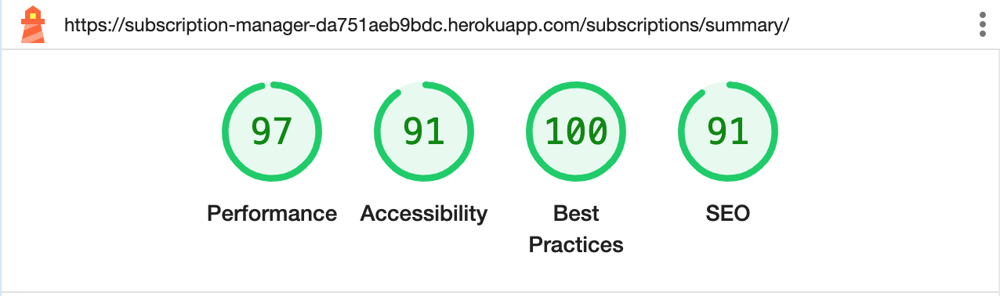

## Table of contents

<!-- TOC -->

- [Table of contents](#table-of-contents)
- [Manual Testing](#manual-testing)
  - [Epic: Account](#epic-account)
  - [Epic: Navigation](#epic-navigation)
  - [Epic: Subscriptions](#epic-subscriptions)
  - [Epic: Reminders](#epic-reminders)
  - [Epic: Services](#epic-services)
  - [Epic: Categories](#epic-categories)
- [Validator Testing](#validator-testing)
  - [HTML](#html)
    - [Fixed Errors](#fixed-errors)
  - [CSS](#css)
  - [Javascript](#javascript)
  - [Python](#python)
  - [Lighthouse](#lighthouse)
- [Browser Testing](#browser-testing)
- [Device Testing](#device-testing)
- [Bugs](#bugs)
  - [Fixed Bugs](#fixed-bugs)
    - [- #### Bug 1](#---bug-1)
  - [Unfixed bugs:](#unfixed-bugs)

<!-- /TOC -->

## Manual Testing

All user stories have been manually tested upon implementation, and this has been documented in each user story by the fulfilled acceptance criteria for each user story. In connection with the deployment to Heroku, which occurred in each sprint, testing was also conducted there. In addition to these continuous tests, manual tests were conducted at the end of sprint 5. The results of these tests are presented below.

### Epic: Account

### Epic: Navigation

### Epic: Subscriptions

### Epic: Reminders

### Epic: Services

### Epic: Categories

## Validator Testing

### HTML

All HTML pages were run through the [W3C HTML Validator](https://validator.w3.org/). For the pages that can be accessed without login, the "Validate by URI" was used. For the pages that does require log in the page source was used as input to the validator, using "Validate by Direct Input".

| Page                   | Logged Out | Logged In |
| ------------------------ | ------------ | ----------- |
| about.html             |            |           |
| add_subscribtion.html  | N/A        | NO ERRORS |
| edit_subscription.html | N/A        | ERROR 1   |
| subscription_list.html | N/A        | NO ERRORS |
| subscription_summary   | N/A        | NO ERRORS |
| login.html             | NO ERRORS  | N/A       |
| logout.html            | N/A        | NO ERRORS |
| signup.html            | ERROR 2    | N/A       |
| 400.html               | No errors  | No errors |
| 500.html               | N/A        | No errors |

#### Fixed Errors

**ERROR 1**

Fixed by removing the action attribute.

**ERROR 2**

This error was harder to find a solution for. After a while i realised that the problem was related to the ul inside the span, which is not allowed. This was resolved by changing <code>form.as_p</code> to <code>form.as_div</code> .

### CSS

The stylesheet style.css was validated using [W3C CSS Validator](https://jigsaw.w3.org/css-validator/) without any errors found.

### Javascript

The Javascript files was validated with [Jshint](https://jshint.com/) with the following results:

| Script  | Result      | Comments       |
| --------- | ------------- | ---------------- |
| add.js  | 1 warning   | Warning 1      |
| base.js | no warnings | Note 1         |
| edit.js | no warnings | Note 1, Note 2 |
| list.js | no warnings | Note 1, Note 2 |

**Warning 1:** The array literal notation [] is preferable. Fixed ([#80](https://github.com/andersganander/Subscription_manager/issues/80)). 
**Note 1:** Comments about the way Materialize components are initialized, f ex:
<code>M.updateTextFields();</code> 
As it was mentioned, but not as a warning I just let it be. It's also the way that Materialize components are initialized in the documentation. 
**Note 2:** One unused variabled reported. Fixed.

### Python

All Python files were run through the [CI Python Linter](https://pep8ci.herokuapp.com/) and all errors were corrected.

### Lighthouse

The pages of the web site were tested using Lighthouse to check performance and accessibility.

Mobile

**Log in**

 

**Sign up**

 

**About**
TBD
 

**Subscription List**

 

**Add subscription**

 

**Edit subscription**

 

**Delete subscription**
Not validated. It seems like the modal used in delete subscription is not "compatible" with Lighthouse validation. When trying to validate the delete page the modal disappears and it looks like the subscription list (which is the page that is shown after deletion) is validated instead
 

**Subscription summary**

 

**Log out**

 

Desktop

**Log in**

 

**Sign up**

 

**About**
TBD
 

**Subscription List**

 

**Add subscription**

 

**Edit subscription**

 

**Delete subscription**
Not validated. It seems like the modal used in delete subscription is not "compatible" with Lighthouse validation. When trying to validate the delete page the modal disappears and it looks like the subscription list (which is the page that is shown after deletion) is validated instead
 

**Subscription summary**

 

**Log out**

 

## Browser Testing

- The Website was tested on Google Chrome, Firefox, Safari browsers with no issues noted.

## Device Testing

- The website was viewed on a variety of devices such as Desktop, Laptop, iPhone SE,  and iPad to ensure responsiveness on various screen sizes in both portrait and landscape mode. The website performed as intended. The responsive design was also checked using Chrome developer tools across multiple devices with structural integrity holding for the various sizes.

## Bugs

### Fixed Bugs

- #### Bug 1

  - **Bug**: When
  - **Fix**: in

### Unfixed bugs:
